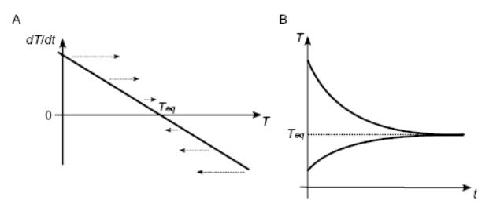

### Basic Concepts of Brain Dynamics

Learning note from book: An introductory course in computational neuroscience

----------------------------------------------------------------

- The Membrane potential: $V_m$;
- The Leak potential: $E_L$;
- The Leak conductance: $G_L$, the ability of charge to leak in and out the cell.
- Membrane capacitance: $C_m$. The capacity of the cell's membrane to store electrical charge.

General differential equation of the $V_m$:

$$\frac{dV_m}{dt} = G_L (E_L - Vm) / C_m$$

$G_L$
$E_L$
$C_m$ are fixed electrical properties of the neuron.

The rate of change of the membrane potentials depends on the last state of itself.

$\dot{V}_m$

An information flow: inputs are received on the dendrites and once sufficient electrical charge accumulates on the surface of the soma, a spike of voltage propagates away from the soma down the axon. 

- Pyramidal cells, most common excitatory cell in the cortex and hippocampus. 

- Purkinje cells, major output cells of the cerebellum, possess the most highly branched of dendrites.

$I_m$ is the inward membrane current, the inward current is equal to the rate of change of charge, $Q$.

$$I_m = \frac{dQ}{dt}$$

The $Q$, can be calculated by capacitance $C$ and potential difference $V$.

$$Q = CV$$

The conductance $G$

velocity equation:

$$V(t) = V_{max}(1 - e^{-t/\tau})$$

$V_max$ is the maximum velocity,

and $\tau$ means how long it takes to approach maximum.

$$\frac{dx}{dt} = V(t) = V_{max} (1 - e^{-t/\tau})$$

$X(t)$ is the explicit analytical solution of the $v(t)$

$$X(t) = V_{max}t-V_{max}\tau (1-e^{-t/\tau})$$

If the change depends on the position:

$$\frac{dx}{dt}  = V(x,t) = v_0[1+x(t)^2]$$

You can see, if $x(t) = 0$, the $V(x,t)$ will be equal to $v_0$. 

A linear dynamic system: Cooling House example

Let's assume that we need to cool a house with AC.

- The $K$ is the hear capacity of the house. Greater for bigger house
- $A$ is the rate of heat extraction (proportional to the power of the air conditioner)
- $T_{ext}$ is the outside air temperature
- $B$ is a measure of how easily heat flows through the wall (leakiness, insulation reduces). 

$$K\frac{dT}{dt} = -A + B(T_{ext} - T)$$

In the following figure, we can know that the The rate of change of the $T$ depends on temperature and it's a linear function. The $T_{eq}$ means the smallest changes in the process, which is a equailiburium point.

The real graph of the coupling between temperature and time is figure B.

If set 

$$ 0 = -A + B(T_{ext} - T) $$

we used $T$ equals to $T_{eq}$

$$T_{eq} = T_{ext} - A/B$$

And the equation can be written as

$$\frac{dT}{dt} = \frac{T_{eq} - T}{\tau}$$

the gradient is $-1/\tau$ from the previous equation. We know that
$\tau = K/B$. 
$\tau$ is a general term to describe the inverse gradient of the time consent term. 

Once we know a linear system has a stable equailiburium point, we also know that it will reach the point as an exponential decay.

$$T(t) = T_{eq} + (T_0 - T_{eq}) exp(-t/\tau)$$

If we assume that $T_0 = T_{ext}$, and 
${T_0 - T_{eq} = A/B}$. The solution is 

$$T(t) = T_{ext} - A/B[1-exp(-Bt)]$$

#### Linear Algebra

$\underline{r}$ represents a list of the firing rates.
$\underline{\underline{r}}$