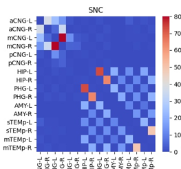

### M. Rubinov, O. Sporns, 2010, Complex network measures of brain connectivity: Uses and interpretations, NeuroImage.

Various measures can be used to detect functional **integration**, **segregation** and **centrality** of individual brain regions.


- Quantify brain networks with a small number of neurobiologically meaningful and easily computable measures
- Useful setting for exploring structural-functional connectivity relationship
- For brain disorders


### The definition of the network

A network is a mathematical representation of a real-world complex system, defined by nodes (vertices) and links (edges) between pairs of nodes.

- Anatomical connections: white matter tracts
- Functional connections: temporal correlations in activity
- Effective connections: direct or indirect causal influences of one region on another.

#### Nodes

It would be less meaningful to lump heterogeneously connected brain regions into single nodes.

Individual brain should not spatially overlap.

The properties will be distinctly different when using different parcellation schemes. Functional and structural networks are compared meaningfully as long as they have same parcellation scheme. 

#### Links
links are differentiated on the basis of their **weight** and **directionality**.

Binary links, presence or absence of connections. 

Weighted links contain information about connection strengths.

Weight threshold is important to filter out the spurious connections, which tend to osbscure the toplogy of strong and significant connections.

#### Network properties

Measurement values of all individual elements comprise a distribution, which is a global property of the network.



#### Degree

The aim of the degree is to illustrate the different representations and variants of a network mesaure (binary weighted, directed and undirected). **The degree of an individual node is equal to the number of links connected to that node**, which is also equal to the number of neighbors of the node. **Individual values of the degree therefore reflect importance of nodes in the network.**

Degree distribution, the degrees of all nodes in the network, is an important marker of network development. 

**The mean network degree** is used as a measure of `density`, or the total _wiring cost_ of the nework. 

The directed variant of the degree, distinguishes `inward links` from `outward links`. **Weighted variant of degree**, defined as the **sum of all neighboring link weights**.

Basic network properties, number of `nodes`, `links`, and `degree distribution` have huge impacts to network measures.

How to do statistical test in network: Null-hypothesis networks. The Null-hypothesis network has same basic property of the network but simple random or ordered topologies forms.


### The python implementation

```python
import bctpy
import networkx as nx
```


-----


