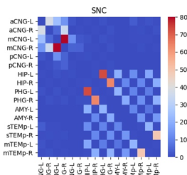
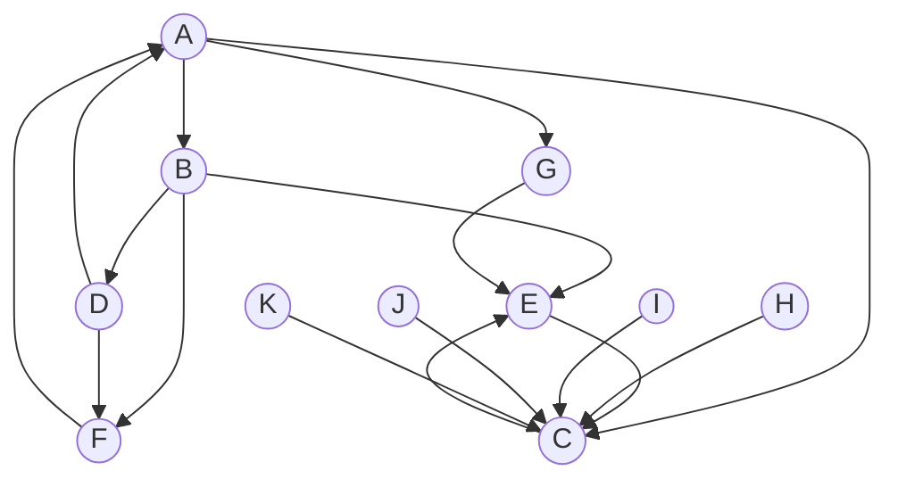

### M. Rubinov, O. Sporns, 2010, Complex network measures of brain connectivity: Uses and interpretations, NeuroImage

Various measures can be used to detect functional **integration**, **segregation** and **centrality** of individual brain regions.

- Quantify brain networks with a small number of neurobiologically meaningful and easily computable measures
- Useful setting for exploring structural-functional connectivity relationship
- For brain disorders

### The definition of the network

A network is a mathematical representation of a real-world complex system, defined by **nodes** (vertices) and **links** (edges) between pairs of nodes.

- Anatomical connections: white matter tracts
- Functional connections: temporal correlations in activity
- Effective connections: direct or indirect causal influences of one region on another.

#### Nodes

It would be less meaningful to lump heterogeneously connected brain regions into single nodes.

Individual brain should not spatially overlap.

The properties will be distinctly different when using different parcellation schemes. Functional and structural networks are compared meaningfully as long as they have same parcellation scheme. 

#### Links

links are differentiated on the basis of their **weight** and **directionality**.

Binary links, presence or absence of connections. 

Weighted links contain information about connection strengths.

Weight threshold is important to filter out the spurious connections, which tend to osbscure the toplogy of strong and significant connections.

#### Network properties

Measurement values of all individual elements comprise a distribution, which is a global property of the network.

#### Degree

The aim of the degree is to illustrate the different representations and variants of a network mesaure (binary weighted, directed and undirected). **The degree of an individual node is equal to the number of links connected to that node**, which is also equal to the number of neighbors of the node. **Individual values of the degree therefore reflect importance of nodes in the network.**

Degree distribution, the degrees of all nodes in the network, is an important marker of network development. 

**The mean network degree** is used as a measure of `density`, or the total _wiring cost_ of the nework. 

The directed variant of the degree, distinguishes `inward links` from `outward links`. **Weighted variant of degree**, defined as the **sum of all neighboring link weights**.

Basic network properties, number of `nodes`, `links`, and `degree distribution` have huge impacts to network measures.

How to do statistical test in network: Null-hypothesis networks. The Null-hypothesis network has same basic property of the network but simple random or ordered topologies forms. An example: random topology but same size, density and binary degree distribution.

#### Functional segregation

A simple definition is a specialized processing to occur within a cluster or modules. 

A straightforward interpretations
- anatomical networks suggest the potential for functional sergregation
- functional networks suggest an organization of statistical dependencies.

How to define the **segregation**?
1. based on the number of triangles in the network. High number of triangles means segregation.

`Clustering Coefficient`: the fraction of triangles around an individual node, equivalent to the fraction of the node's neighbors that are also neighbors of each other. 

The mathematical expression of the triangles calculation is that 

$$\mathbf Ti = \frac{1}{2} \sum_{h,j\in N} \mathbf a_{ih} \mathbf a_{ij} \mathbf a_{jh} \tag{1}$$

The equation (1) can be used to calculate the `Clustering Coefficient`. 

$$C = \frac{1}{n} \sum_{i\in N} C_i = \frac{1}{n} \sum_{i\in N} \frac{2t_i}{k_i(k_i-1)}\tag{2}$$

In this formula, the $k_i$ is the degree, which we have mentioned above, defined as the number of links connected to a node. The math equation is as below:

$$k_i = \sum_{j\in N} \mathbf a_{ij}\tag{3}$$

`Mean clustering coefficient`, reflects, on average, the prevalence of clustered connectivity around individual nodes. Influenced by nodes with a low degree.

`Transitivity`: A classical variant of the clustering coefficient, is normalized collectively and consequently doesn't influence from it.

The math formula of the `Transitivity`:

$$T = \frac{\sum_{i \in N}2t_i}{\sum_{i\in N}K_i(K_i-1)}\tag{4}$$

#### Modularity

More sophisticated measures of segregation, including community structure. The practical method is to subdividing the network into groups of nodes, with a **maximally possible number** of withinin group links, and a **minimally possible number** of between-group links.

Algorithm are used to find the optimal modular structure of a network. The first is optimization algorithm; The second one is to detect the hierarchy of modules (presence of smaller modules inside larger modules).

Single node may belong in different modules simultaneously.

#### Functional integration

The ability to rapidly combine specialized information from distributed brain regions. The basic concepts are based on the path. 

Path in anatomical networks represents potential routes of information flow between pairs of brain regions.

An important property is the **Lengths**. Lengths consequently estimate the potential for functional integration between brain regions. **Shorter paths indicate stronger potential for integration**.

Paths in fMRI data represent sequences of statistical associations and may not correspond to information flow on anatomical connections.

**Not straightforward to intepret unless fMRI data has anatomical data at the same time**

Average shortest paths: **characteristic path length**.

The mathematical expression of the path:

$$d_{ij} = \sum_{\mathbf a_{uv} \in gi\leftrightarrow j} \mathbf a_{uv}, \tag{5}$$

where $gi\leftrightarrow j$ is the shortest path (geodesic) between i and j. $d_ij = \infty$ for all disconnected pairs ${i}$ and ${j}$. The ${u}$ and ${v}$ are two neighboring ndoes.

Another important measures: `Global Efficiency`. **The average inverse shortest path length** is the `Global Efficiency`. 

Thus, the mathematical formula of the `Global Efficiency` is

$$\mathbf E_{global} = \frac{1}{n}\sum_{i \in N}\frac{\sum_{i\neq j \in V} d_{ij}}{n-1}\tag{6}$$

The single efficiency is $\mathbf E_i = \frac{\sum_{i\neq j \in V} d_{ij}}{n-1}$

characteristic path length is influenced by long path but `Global Efficiency` is influenced by short path. 

Two different paths:
- binary path length, the number of links in the path
- weighted path, the total sum of individual link lengths

link lengths are inversely related to link weights. Larger weights represent stronger associations and close proximity. 

structural and effective connectivity networks have high global efficiency, functional networks have weaker connections between modules, a lower global effciency.

#### Small-world brain connectivity

A well designed organization could therefore combine the presence of functionally specialized (segregation) amodule with a robust number of intermodular (integration) links. 

An optimal balance of functional integration and segregation. 

Small world network should be simultaneously highly segregated and integrated. 

#### Motif

Motif is more about directed network to analyze the pattern of local connectivity.

#### Centrality

The straightforward neurobiological interpretation: nodes with high degree are interacting structurally or functionally with many other nodes in the network.

`Participation Coefficient` assesses the diversity of intermodular interconnections of individual nodes. Nodes with a high within-module degree but with a low `Participation Coefficient` (known as provincial hubs) are hence likely to play an important role in the facilitation of modular segregation. Nodes with high `Participation Coefficient` (connector hubs) are likely to facilitate global intermodular integration.

$$y_{i} = 1- \sum_{m \in M} (\frac{k_i(m)}{k_i})^2\tag{7}$$

where ${M}$ is the set of modules (see modularity), and ${ki (m)}$ is the number of links between ${i}$ and all nodes in module ${m}$.

`Closeness Centrality`: defined as the inverse of the average shortest path length from one node to all other nodes.

The mathematical expression: 

$$L_{i}^{-1} = \frac{n-1}{\sum_{j \in N, j \neq i }d_{ij}}\tag{8}$$

`Betweenness Centrality`: defined as the fraction of all shortest paths in the network that pass through a given node. The bridging node connects disparate parts of the network often have a high `Betweenness Centrality`.

The mathematical expression:

$$b_{i} = \frac{1}{(n-1)(n-2)}\sum_{\mathclap{\substack{h,j \in N \\ h\neq j,\\ h\neq i,\\ j\neq i}}} \frac{\mathbf P_{hj}^{(i)}}{\mathbf P_{hj}}\tag{9}$$

Different intepretation in centrality:

- In anatomical network, central node oftern facilitate integration, and enable functional links between anatomical unconnected regions.

**Caveats as path-based measures of integration**

#### Network Resilience

The anatomical features that define the vulnerability to insult the network. One of them is the degree distribution.

complex network with power-law `degree distribution` may be resilient to gradual random deterioration, but highly vulnerbale to disruptiuon of high-degree central nodes.

`Assortativity Coefficient` is a correlation coefficient between the degrees of all nodes on two opposite ends of a link. 

An example below: To calculate the `Assortativity Coefficient` of link between node C and E, we need to calculate the degrees from two sides, C side (K, J, E, I, H) and E side (C, B, G)

`average neighbor degree`

`local assortativity coefficient`

### The python implementation

See [notebook](../../demos/Rubinov2010Demo.ipynb)

-----

